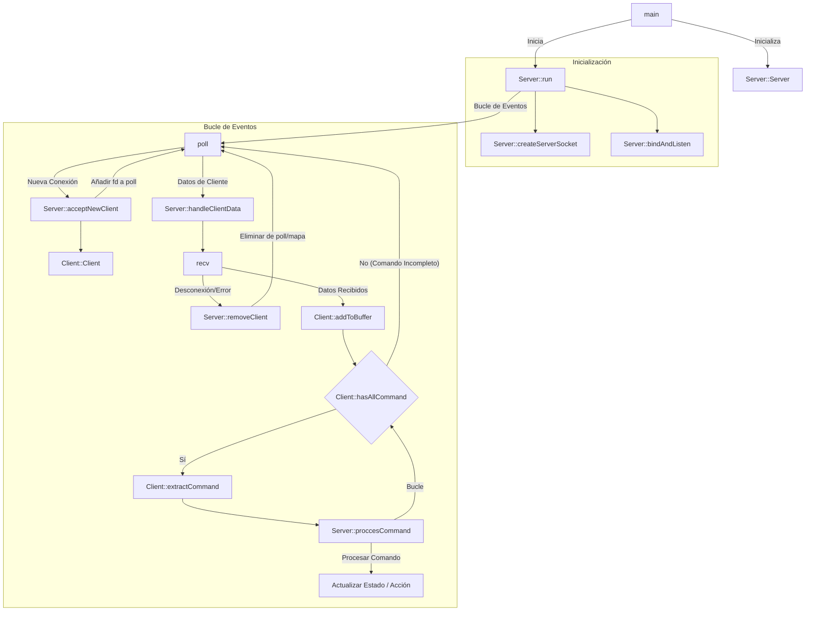

_This project has been created as part of the 42 curriculum by smarin-a, jdelorme y integrnate aun por confirmar_

# ft_irc

## Descripción

`ft_irc` es un servidor de Internet Relay Chat (IRC) implementado en C++98. Este proyecto tiene como objetivo replicar la funcionalidad de un servidor IRC real, permitiendo a los usuarios conectarse, unirse a canales y enviar mensajes en tiempo real, todo ello gestionando sockets no bloqueantes y I/O multiplexing.

## Instrucciones

### Compilación

Para compilar el proyecto, ejecuta el siguiente comando en la raíz del repositorio:

```bash
make
```

Esto generará el ejecutable `ft_irc`.

### Ejecución

Para iniciar el servidor, utiliza el siguiente formato:

```bash
./ft_irc <port> <password>
```

- `<port>`: El puerto en el que el servidor escuchará conexiones entrantes (e.g., 6667).
- `<password>`: La contraseña requerida para que los clientes se conecten.

Ejemplo:

```bash
./ft_irc 6667 mi_contraseña_segura
```

## Funciones Clave del Sistema (ft_irc)

Este proyecto es una implementación de un servidor IRC escrito en **C++98**, utilizando APIs de redes de UNIX de bajo nivel.
A continuación se presenta un breve resumen de las funciones del sistema más importantes utilizadas en el proyecto y su papel dentro del servidor.

### Creación y configuración de sockets

- **socket()**
  Crea un socket TCP que será utilizado por el servidor para aceptar conexiones entrantes.

- **setsockopt()**
  Se utiliza para configurar opciones de socket como `SO_REUSEADDR`, permitiendo reiniciar el servidor sin esperar a que el puerto sea liberado.

- **bind()**
  Asocia el socket con una dirección IP y puerto específicos proporcionados como argumentos del programa.

- **listen()**
  Marca el socket como pasivo, habilitándolo para aceptar conexiones entrantes de clientes.

### Manejo de conexiones de clientes

- **accept()**
  Acepta una nueva conexión entrante y devuelve un nuevo descriptor de archivo dedicado a un solo cliente. Cada cliente conectado tiene su propio socket.

- **close()**
  Cierra un socket de cliente o servidor y libera los recursos asociados.

### Transmisión de datos

- **recv()**
  Recibe bytes crudos desde un socket de cliente. Dado que TCP se basa en flujos, los datos pueden llegar parcialmente o combinados, requiriendo buffering y reconstrucción de mensajes.

- **send()**
  Envía datos a un socket de cliente. El envío puede ser parcial, por lo que los mensajes salientes se almacenan en buffers de salida hasta que se transmiten completamente.

### Multiplexación y E/S no bloqueante

- **poll()** (o equivalente)
  El núcleo del bucle del servidor. Permite monitorear múltiples sockets simultáneamente para eventos de lectura/escritura usando un único mecanismo de sondeo, sin bloquear el proceso.

- **fcntl()**
  Utilizado para establecer sockets en modo no bloqueante (`O_NONBLOCK`), asegurando que el servidor nunca se bloquee en operaciones de E/S.
  En macOS, esto es requerido para lograr un comportamiento no bloqueante consistente.

### Utilidades de orden de bytes de red

- **htons() / htonl()**
  Convierten valores del orden de bytes del host al orden de bytes de la red (usado para puertos e IPs).

- **ntohs() / ntohl()**
  Convierten valores del orden de bytes de la red de vuelta al orden de bytes del host.

### Utilidades de dirección y protocolo

- **getaddrinfo() / freeaddrinfo()**
  Resuelven nombres de host y servicios en estructuras de dirección de socket utilizables (IPv4 / IPv6).

- **inet_addr(), inet_ntoa(), inet_ntop()**
  Convierten direcciones IP entre formatos binarios y legibles por humanos, utilizados principalmente para depuración y registro.

### Manejo de señales (opcional)

- **signal(), sigaction()**
  Utilizados para manejar señales del sistema como `SIGINT`, permitiendo que el servidor se apague limpiamente cuando es interrumpido.

### Notas

- Todas las operaciones de E/S son no bloqueantes.
- Solo se utiliza una llamada a `poll()` para gestionar todos los sockets.
- El servidor está diseñado como un bucle impulsado por eventos sin `fork()` ni hilos.
- Los datos entrantes se almacenan en buffers por cliente y se reconstruyen en comandos IRC completos antes de su análisis y ejecución.

## Recursos

Este proyecto se ha desarrollado siguiendo los estándares oficiales del protocolo IRC:

- [RFC 1459](https://tools.ietf.org/html/rfc1459) - Protocolo IRC (Internet Relay Chat)
- [RFC 2812](https://tools.ietf.org/html/rfc2812) - Arquitectura Cliente-Servidor IRC

## Diagrama de Flujo del Programa



## Detalle de Funciones

### 1. Punto de Entrada (Main)

- **`main(int argc, char **argv)`\*\*:
  - Valida los argumentos de línea de comandos (puerto y contraseña).
  - Crea una instancia de la clase `Server`.
  - Llama a `server.run()` para iniciar el servidor.

### 2. Inicialización del Servidor

- **`Server::Server(int port, std::string &password)`**:
  - Constructor. Inicializa el objeto servidor con el puerto y contraseña dados.
- **`Server::run()`**:
  - Función principal de ejecución.
  - Llama a `createServerSocket()` y `bindAndListen()`.
  - Configura el bucle principal `poll()` para manejar múltiples conexiones concurrentemente.
- **`Server::createServerSocket()`**:
  - Crea un socket TCP (`socket()`).
  - Habilita `SO_REUSEADDR` para reiniciar inmediatamente en el mismo puerto.
  - Configura el socket en modo no bloqueante (`fcntl(O_NONBLOCK)`).
- **`Server::bindAndListen()`**:
  - Asocia el socket al puerto especificado (`bind()`).
  - Comienza a escuchar conexiones entrantes (`listen()`).

### 3. Bucle de Eventos (`poll`)

El servidor entra en un bucle infinito esperando eventos mediante `poll()`.

- **`poll()`**:
  - Espera un evento en uno de los descriptores de archivo en `_pollFds` (socket del servidor o clientes).
  - Si hay actividad en el **socket del servidor**, significa que un nuevo cliente intenta conectarse.
  - Si hay actividad en un **socket de cliente**, significa que el cliente envió datos o se desconectó.

### 4. Manejo de Conexiones

- **`Server::acceptNewClient()`**:
  - Acepta la conexión entrante (`accept()`).
  - Configura el nuevo socket del cliente como no bloqueante.
  - Crea un nuevo objeto `Client`.
  - Añade el descriptor de archivo del nuevo cliente al vector `_pollFds` para ser monitorizado por `poll()`.
- **`Client::Client(int fd)`**:
  - Constructor para un nuevo cliente. Inicializa el estado (no autenticado, buffers vacíos, etc.).

### 5. Manejo de Datos

- **`Server::handleClientData(int i)`**:
  - Llamado cuando un cliente envía datos.
  - Lee datos en un buffer usando `recv()`.
  - Si `recv()` devuelve 0 o -1, el cliente se desconectó o hubo un error -> llama a `removeClient()`.
  - De lo contrario, añade los datos al buffer interno del cliente (`Client::addToBuffer()`).
  - Itera mientras el buffer del cliente contenga un comando completo (terminado por `\r\n`).
- **`Server::removeClient(int fd)`**:
  - Elimina al cliente del mapa `_clients` y del vector `_pollFds`.
  - Cierra el socket (`close()`).
  - Libera la memoria del objeto `Client`.

### 6. Procesamiento de Comandos

- **`Client::addToBuffer(std::string)`**:
  - Añade los datos crudos recibidos al `_inputBuffer` del cliente.
- **`Client::hasAllCommand()`**:
  - Comprueba si `_inputBuffer` contiene un comando completo (busca `\r\n`).
- **`Client::extractCommand()`**:
  - Extrae la siguiente cadena de comando de `_inputBuffer` (hasta `\r\n`) y la elimina del buffer.
- **`Server::proccesCommand(Client* client, std::string command)`**:
  - La lógica central para manejar comandos IRC.
  - Identifica el comando (ej. `NICK`, `USER`, `PASS`, `PING`, `QUIT`).
  - Ejecuta la lógica correspondiente:
    - **`PASS`**: Verifica si la contraseña coincide con la del servidor.
    - **`NICK`**: Establece el apodo del cliente.
    - **`USER`**: Establece el nombre de usuario/real.
    - **`PING`**: Responde con `PONG`.
    - **`QUIT`**: Desconecta al cliente.
